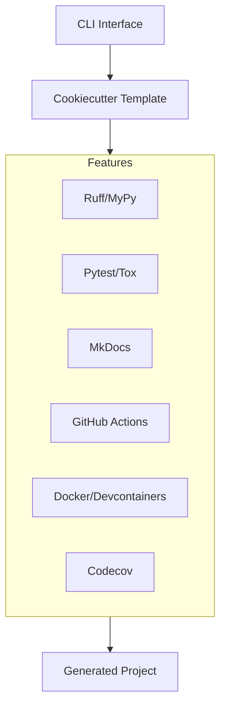

# UVI Project Deep Analysis

Based on my thorough review of the UVI project, I've prepared a comprehensive audit of its strengths and weaknesses.

## Project Overview

UVI (UV Init) is a modern Python project generator built with Cookiecutter that creates pre-configured Python projects optimized for the UV package manager. It sets up a complete project structure with modern development tools, testing frameworks, documentation, CI/CD workflows, and more. The project is currently at version 0.5.0.

## Strengths

### 1. Modern Toolchain Integration

- **UV Integration**: First-class integration with UV package manager
- **Up-to-date Tools**: Uses modern development tools (Ruff 0.9.10, MyPy 1.15.0, Pytest 8.3.5)
- **Recent Modernization**: Successfully migrated from Pylint to Ruff with Pylint-equivalent rules
- **Comprehensive Tooling**: Includes pre-commit hooks, code coverage, documentation generation

### 2. Comprehensive Project Generation

- **Complete Structure**: Generates fully functional project structure
- **Feature Selection**: Configurable features via interactive prompts
- **Multi-version Support**: Works with Python 3.10, 3.11, 3.12, and 3.13
- **Flexibility**: Users can tailor generated projects to their needs

### 3. Well-Architected Code

- **Clean Architecture**: Clear separation of concerns with layered architecture
- **Error Handling**: Robust error handling in CLI implementation
- **Cross-platform**: Works across different operating systems with proper fallbacks
- **Type Safety**: Thorough type annotations throughout the codebase

### 4. Smart User Information Prefill

- **Tiered Approach**:
  1. GitHub CLI (primary source)
  2. Git configuration (fallback)
  3. Generic defaults (last resort)
- **User-friendly**: Clear feedback about information sources
- **GitHub Integration**: Retrieves accurate GitHub username when available

### 5. Comprehensive Documentation

- **MkDocs Integration**: Well-structured documentation with Material theme
- **Feature Documentation**: Each feature is documented
- **Future Planning**: Detailed briefs for planned enhancements
- **Project Memory**: Well-maintained memory bank for project knowledge

### 6. Strong Testing Infrastructure

- **Multiple Python Versions**: Tests against Python 3.10 through 3.13
- **Test Coverage**: Good test coverage with pytest-cov
- **Future Improvements**: Planning migration from Tox to Nox

## Weaknesses

### 1. CLI User Experience Limitations

- **Strict Binary Inputs**: Only accepts exact "y" or "n" inputs (enhancement planned)
- **No Tool Verification**: Doesn't check for required tools like `gh` or `uv`
- **Template Download Issue**: Re-prompts for template download unnecessarily
- **Limited Command-line Options**: Few options available via CLI arguments

### 2. Configuration Flexibility Gaps

- **Python Version**: No python_version selection option
- **Limited Customization**: Some features have minimal configuration options
- **No Environment Variables**: Lacks .env file handling capability
- **No Codemapper Option**: Missing codemapper integration

### 3. Dependency Management Challenges

- **Version Parity**: Potential mismatches between main project and template dependencies
- **No Automated Synchronization**: Manual updates required to keep versions in sync
- **Documentation Lag**: Documentation may not reflect latest dependency versions

### 4. CI/CD and Documentation Deployment

- **Makefile Limitations**: docs-deploy function needs improvement
- **GitHub Pages**: No automated GitHub Pages integration
- **Publishing Workflow**: Trusted PyPI publishing not yet implemented

### 5. Technical Debt

- **Linting Issues**: Remaining linting issues in info/ directory
- **Tox Dependency**: Still using Tox rather than more modern Nox (migration planned)
- **Limited Error Messages**: Some error scenarios could use more detailed feedback

## Recommendations

### Short-term Improvements

1. **Implement Enhanced Binary Input Handling**: Complete the planned enhancement to accept y/Y/yes/1 and n/N/no/0
2. **Fix Template Download Behavior**: Implement smart caching with `force_download` parameter
3. **Add Tool Availability Checks**: Verify `gh` and `uv` are installed
4. **Fix Linting Issues**: Resolve remaining issues in info/ directory

### Medium-term Improvements

1. **Complete Tox to Nox Migration**: Follow the migration plan in docs/briefs/tox-to-nox-migration.md
2. **Add Python Version Selection**: Allow users to choose target Python version
3. **Implement Dependency Parity**: Ensure versions match between main project and template
4. **Improve Documentation Deployment**: Enhance the Makefile's docs-deploy function

### Long-term Strategic Improvements

1. **Enhanced CLI Options**: Add more command-line options for non-interactive use
2. **Trusted PyPI Publishing**: Add secure PyPI publishing workflow
3. **Environment Variable Support**: Add .env file handling capabilities
4. **Comprehensive Templating Strategy**: Address cookiecutter maintenance concerns

## Conclusion

UVI is a well-designed, modern project with strong foundations. It successfully achieves its core goal of simplifying Python project creation with UV integration. The recent improvements to user information prefill and the migration to Ruff demonstrate active maintenance and modernization efforts.

The project has a clear roadmap for addressing its current limitations, with detailed briefs for most planned enhancements. By focusing on the identified weaknesses, particularly around user experience and configuration flexibility, UVI can further strengthen its position as a valuable tool for Python developers looking to adopt modern practices.
