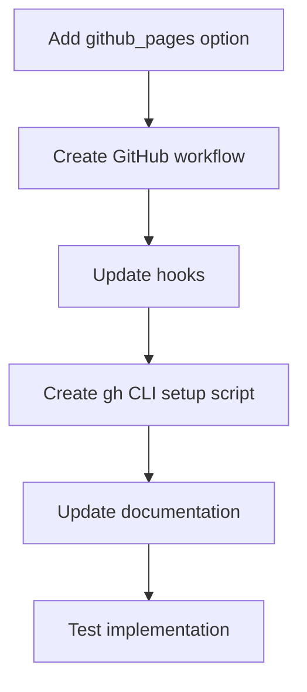

# GitHub Pages Integration

## Feature Overview

Add a new feature to the UVI project and cookiecutter template that includes the option to set up automatic GitHub Pages publishing for project documentation.

## Current State

UVI already has MkDocs integration and GitHub Actions support, with documentation deployment to GitHub Pages implemented but requiring manual steps:

1. Users must set workflow permissions in GitHub repository settings
2. Create a release to trigger deployment
3. Manually configure GitHub Pages to use the gh-pages branch

## CLI Requirements

UVI should strongly suggest (but not require) installing GitHub CLI to enable features like automatic GitHub Pages setup. During the project creation process, UVI should:

- Check if GitHub CLI is installed
- Provide friendly notification about enhanced features available with GitHub CLI
- Suggest how to install GitHub CLI for users who want these features
- Gracefully handle cases where GitHub CLI is not installed by falling back to manual instructions

## Implementation Plan



### 1. Add Option to cookiecutter.json

Add a new parameter to the configuration:

```json
"github_pages": ["y", "n"]
```

This option should only be shown if both `include_github_actions` and `mkdocs` are set to "y", as it requires both to function.

### 2. Create GitHub Workflow File

Create a dedicated GitHub Pages deployment workflow file in the template:

- `{{cookiecutter.project_name}}/.github/workflows/docs-deploy.yml`
- This workflow will:
  - Build the documentation using MkDocs
  - Deploy to GitHub Pages with proper permissions configuration
  - Run automatically on pushes to main branch

### 3. Update Template Hooks

In addition to our original plan, we'll:

- Check if gh CLI is installed during the post-generation process
- Provide clear error messages if gh CLI is missing

### 4. Create GitHub Pages Setup Script

Create a new script that will:

- Use gh CLI to enable GitHub Pages for the repository
- Configure the Pages source to use the gh-pages branch
- Set required repository permissions for GitHub Actions workflows
- Verify the configuration was successful

This script could be added to the post-generation hook or as a separate utility the user can run after creation.

### 5. Update Documentation

In addition to our original documentation plan:

- Document the requirement for gh CLI
- Provide instructions for manual setup if gh CLI is not available
- Explain the automatic configuration process

## Implementation Details for GitHub CLI Integration

The gh CLI commands we'll use include:

```bash
# Check if repository exists (will be used in validation)
gh repo view --json name

# Enable GitHub Pages with gh-pages branch as source
gh api --method PUT /repos/{owner}/{repo}/pages \
  -f build_type="workflow" \
  -f source="gh-pages"

# Set repository workflow permissions
gh api --method PUT /repos/{owner}/{repo}/actions/permissions \
  -f default_workflow_permissions="write" \
  -f can_approve_pull_request_reviews=true
```

## Benefits of This Approach

1. **Fully Automated**: Users won't need to manually configure GitHub Pages settings
2. **Immediate Deployment**: Documentation can be published as soon as the first push
3. **Simplified Workflow**: Removes multiple manual steps from the process
4. **Better User Experience**: Reduces friction for users new to GitHub Pages

## Testing Strategy

1. **Document Baseline Behavior**
   - Create an example project with current code
   - Document the manual steps needed for GitHub Pages setup
   - Save artifacts for comparison

2. **Implement Changes**
   - Make code modifications to add the new feature
   - Run linting and static analysis
   - Run the test suite to verify functionality

3. **Verify Implementation**
   - Create example projects with the new feature enabled
   - Verify GitHub Pages is properly configured
   - Test edge cases (missing gh CLI, existing repository configuration)

4. **A/B Comparison**
   - Compare the original manual process with the automated approach
   - Document time savings and reduced complexity
