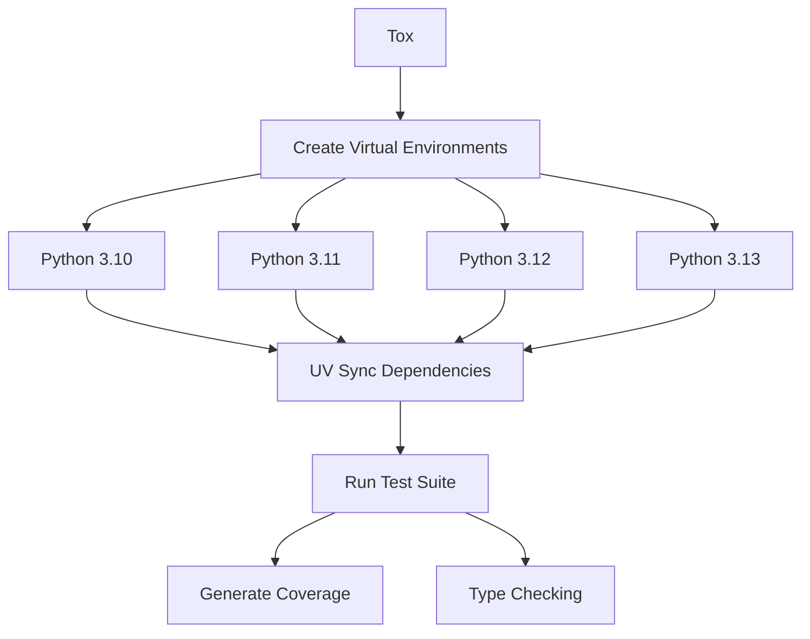
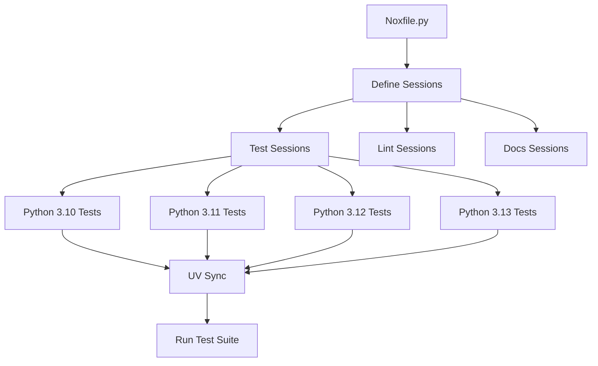

# UVI System Patterns

## System Architecture

UVI uses a layered architecture with the following components:

### Core Components

1. **CLI Interface (uvi/cli.py)**

   - Entry point for user interaction
   - Parses command-line arguments
   - Invokes cookiecutter with the appropriate template

2. **Template System**

   - Uses cookiecutter for templating
   - Configuration defined in cookiecutter.json
   - Handles variable substitution

3. **Generation Hooks**

   - Pre-generation validation (hooks/pre_gen_project.py)
   - Post-generation cleanup (hooks/post_gen_project.py)
   - Conditional file removal based on user choices

4. **Project Structure**
   - Template files in {{cookiecutter.project_name}}/
   - Configurable components based on user selections

## Key Technical Decisions

1. **Cookiecutter as Template Engine**

   - Mature, widely-used templating system
   - Supports pre/post generation hooks
   - Handles complex templating requirements

2. **UV for Dependency Management**

   - Modern, fast Python package manager
   - Better performance than pip/poetry
   - Core focus of the generated projects

3. **CLI-First Approach**

   - Simple command-line interface
   - No complex GUI or web interface
   - Focus on developer experience

4. **Explicit Configuration**
   - All options clearly defined in prompts
   - No hidden defaults or magic
   - User in control of all features

## Design Patterns in Use

1. **Template Method Pattern**

   - Hooks define the skeleton of operations
   - Concrete implementations determined by user choices

2. **Factory Pattern**

   - Creates project structure based on configuration
   - Different "products" (features) based on user input

3. **Command Pattern**

   - CLI executes a series of operations
   - Encapsulates all the logic needed to perform actions

4. **Decorator Pattern**
   - Configuration options add or remove features
   - Base project enhanced with optional components

## Testing Architecture

The testing infrastructure is a key component of both UVI itself and the generated projects.

### Current Pattern: Tox

- Configuration-based via tox.ini
- Declarative environment specification
- Integration with GitHub Actions via gh-actions section
- Uses tox-uv plugin for UV integration

### Planned Pattern: Nox

- Python-native configuration via noxfile.py
- Programmatic session definition with explicit dependency management
- Direct UV integration without plugins
- Enhanced flexibility through Python functions

## Component Relationships

## File Structure

- `uvi/` - Package containing the CLI tool
- `hooks/` - Pre/post generation scripts
- `{{cookiecutter.project_name}}/` - Template for generated projects
- Configuration files (cookiecutter.json, pyproject.toml, etc.)

## Processing Flow

1. User runs `uvi` command
2. CLI parses arguments and invokes cookiecutter
3. Cookiecutter presents interactive prompts
4. Pre-generation hook validates inputs
5. Template is processed with user selections
6. Post-generation hook cleans up based on choices
7. Final project is generated in the filesystem
